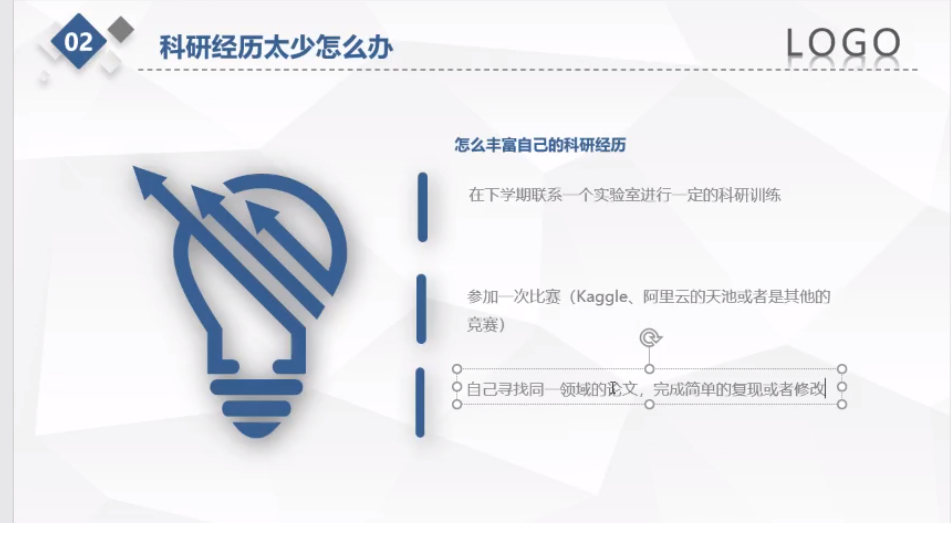

## README 二级标题


#### 四级标题

> 链接外部网站
>
> 


[back to helloworld](helloworld.txt)

[这是博客](https://microxy.github.io/)

[这是github](https://github.com/)




```c
#include <stdio.h>
int main()
{
    return 0;
}
```

> 破折号
>
> 好了

* [red] cajflsdfjsl

* [green] csac
  * 你手上你看

1. 你好

2. hello

3. hi

4. no

   

| 学校 | 专业        | 和         |
| ---- | ----------- | ---------- |
| JLU  | 网络安全sda | 地处四川省 |

**加粗**

__加粗__

_歪了_

*好家伙*

~~这是不要的~~

~~好的吧~~

***

分割线

---

---

***

---------------


